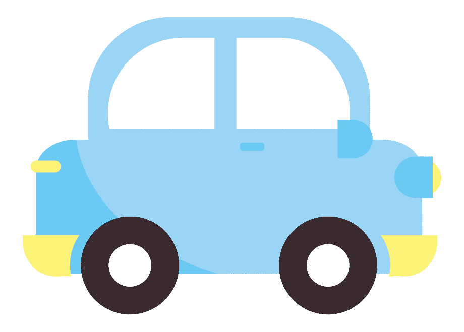

# Roteiro de apresentação

## O que são?
- ## Classe
É um **conjunto de objetos** que possuem características **semelhantes**.
Um **molde abstrato** que descreve propriedades e comportamentos de entidades do mundo real.

Representa a abstração de um tipo de dado, objeto ou estrutura.

#### Exemplo:
- Classe **Carro**
> Veículo de 4 rodas que possui um motor, utiliza alguma fonte de
> energia para o motor, acomoda o motorista e passageiros* e possibilita
> a locomoção dos mesmos para longas distâncias.

**Atributos**       | **Funcionalidades**
---                 | ---
Potência do motor	| Ligar/Desligar carro
Cor do carro 		| Acelerar
Tipo de combustível	| Frear
Número de portas    | Abastecer
...                 | ...

- ## Objeto

É a atribuição das características de uma classe à uma variável, função ou estrutura de dados.

## Relação entre Classes e Objetos

<!--todo converter as imagens em png-->

Modelo abstrato de um carro
x | Carro 1 | Carro 2 | Carro 3
--- | --- | --- | ---
Objeto |  |  | 
Cor | Vermelho | Azul | Verde
Motor | 1.0 | 1.6 | 2.0
Combustível | Gasolina | Flex | Gasolina
Nº de portas | 4 | 2 | 2

O caminhão compartilha de alguns atributos dos carros, como **motor**, **faróis**, **motorista**, **combustível** porém propriedades como **tamanho**, **número de rodas** e **carroceria** o diferem o suficiente para classificá-lo como outro veículo.

Assim podemos perceber a herança na orientação à objetos, onde `Veiculo` seria a classe mãe, e seus filhos `Carro`, `Caminhão`, `Motocicleta`...

## Instância de uma classe

>"[...] objects are instantiated from a class, and each object is referred to as an instance of the class". - [Diane Zak](https://books.google.com.br/books?id=o_q5BwAAQBAJ&pg=PA552&dq=OOP%20instance%20terminology&hl=pt-BR&sa=X&redir_esc=y#v=onepage&q=OOP%20instance%20terminology&f=false)

>"[...] objetos são instanciados de uma classe, e cada objeto é referido como uma instância da classe". - Diane Zak

A definição de instância de classe e objeto é um tanto quanto confusa, há uma linha tênue entre as duas definições, na qual ambas podem ser intercambiáveis sem estar completamente corretas ou incorretas, de maneira mais clara, é possível dizer que a instância de uma classe é a ação de criar o objeto, e o objeto é a instanciação da classe, é o produto físico que veio do molde.

Utilizando o exemplo da classe `Carro`, podemos atribuir o significado de instância da classe à fábrica do carro, e o objeto ao carro em si. A fábrica é responsável por realizar a montagem das peças e acessórios segundo o molde de criação, assim, podemos dizer que instanciar uma classe é fazer a atribuição das características à um objeto, e o objeto seria o carro fabricado a partir do molde da fábrica e com atributos que o diferenciam dos demais carros.

> "Mas e se todos os atributos forem iguais?"

Nada impede de termos dois objetos iguais, mas é errado dizer que são o mesmo objeto, já que possuem identificadores diferentes, o carro possui a placa de identificação e o objeto tem sua refência ao local armazenado em memória.

## Propriedades e Métodos

### collapsible markdown?

CLICK ME

#### Conteúdo
`print("hello")`

# Referências
- Definição de classes e objetos:

[Alura](https://www.alura.com.br/artigos/poo-programacao-orientada-a-objetos?gclid=Cj0KCQjw8vqGBhC_ARIsADMSd1DKHbAbBqeFu9Imi7Rl_vl6o8CZKuDUyvs9L8iyFZ_naxn91V52FUkaAnmcEALw_wcB)\
[DCA/Unicamp](https://www.dca.fee.unicamp.br/cursos/PooJava/classes/conceito.html)\
[Wikipedia - Classe](https://pt.wikipedia.org/wiki/Classe_(programa%C3%A7%C3%A3o))\
[Wikipedia - Objeto](https://pt.wikipedia.org/wiki/Objeto_(ci%C3%AAncia_da_computa%C3%A7%C3%A3o))

- Relação entre classes e objetos:

- Instância de uma classe:

[Stack Overflow](https://pt.stackoverflow.com/questions/192233/diferen%C3%A7a-entre-objeto-e-inst%C3%A2ncia)\
[Wikipedia](https://pt.wikipedia.org/wiki/Inst%C3%A2ncia_(ci%C3%AAncia_da_computa%C3%A7%C3%A3o))

<!--stackedit_data:
eyJoaXN0b3J5IjpbMjE5NjY1MTE3XX0=
-->